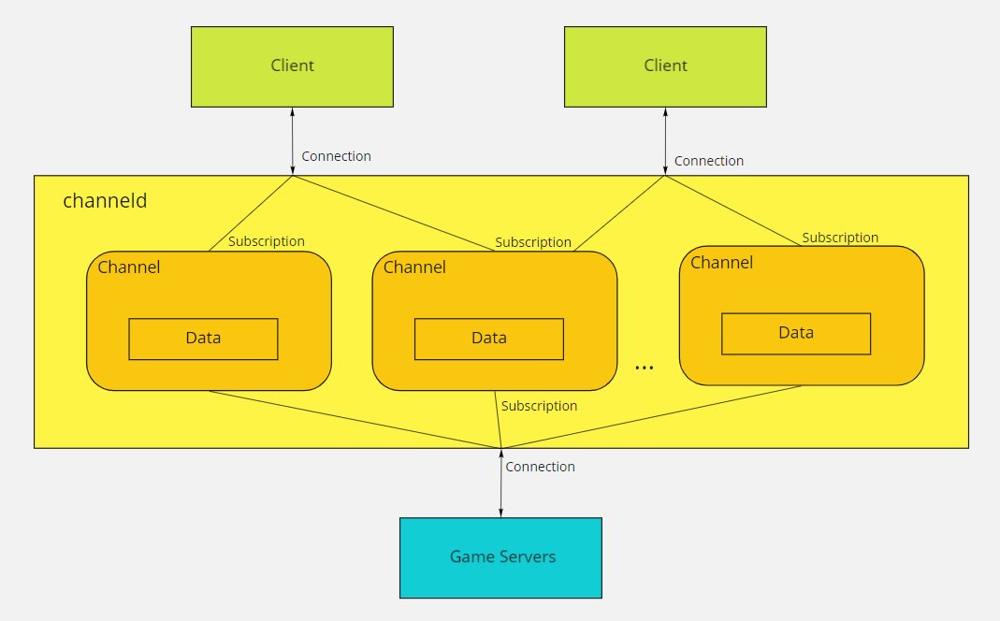
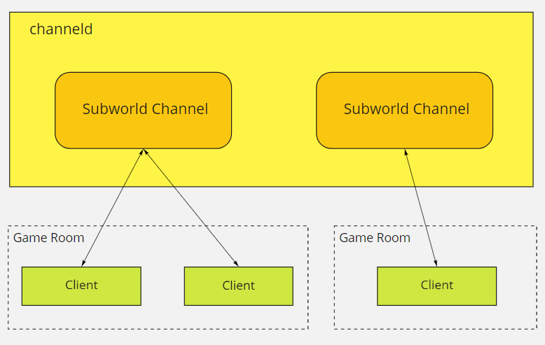
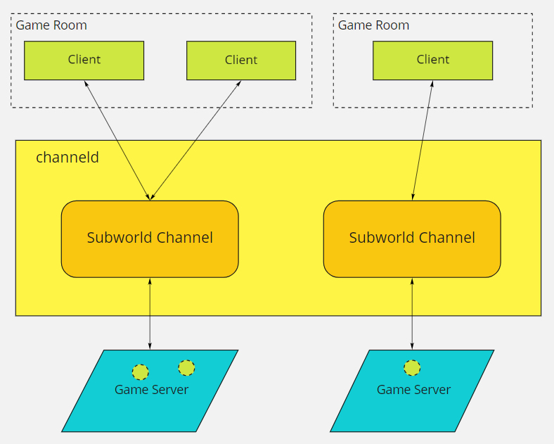
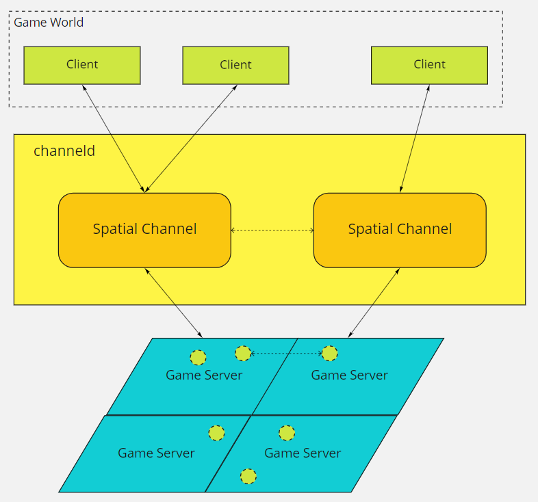

# Overview
channeld is an open source, light-weight and efficient **messaging gateway** server designed for **distributed game servers** (typically MMO) 
and other backend applications that require real-time, subscription-based user interaction with high concurrency (e.g. instance messenger server).

See the concepts in the [design doc](doc/design.md).

## Applications:
There are three major types of application benifit from channeld's architecture design:
### Relay Servers:

channeld can be used as the relay server to forward/broadcast messages between game clients.

### Dedicated Server Gateway:

channeld can be used as the gateway server to route messages to different dedicated servers.

### Seamless Distributed Server:

The ultimate purpose of channeld is to enable distributed composition of dedicated servers, together to form a seamless large virtual world.

## Key features:
* Protobuf-based binary protocol over TCP, KCP or WebSocket
* FSM-based message filtering
* Fanout-based data pub/sub of any type defined with Protobuf
* Area of interest management based on channel and data pub/sub
* [WIP] Backend servers load-balancing with auto-scaling
* [WIP] Integration with the mainstream game engines ([Unity](https://github.com/indiest/channeld-unity-mirror), Unreal Engine)

## Performance
channeld is aimmed to support 10Ks connections and 100Ks mps(messages per second) on a single node (uplink + downlink), and 10Ms mps in a distributed system.

## Roadmap
Currently, the completeness of the project is 30%.

There is a [dedicated roadmap documentation](doc/roadmap.md).

Keep in mind that the requirements of the real-life projects will decide the priority of the development.

# Getting Started
## 1. Clone the source code
## 2. Docker
The fastest way to run the server is with [Docker Compose](https://docs.docker.com/compose/).

There's a [docker-compose file](docker-compose.yml) set up for running the chat rooms demo. Navigate to the root of the repo and run the command:

`docker-compose up -d`

## 3. The chat rooms demo
After starting the server, browse to http://localhost:8080.

Use the input box at the bottom to send messages, to the GLOBAL channel by default. The input box can also be used to send commands, which are started with '/'. The supported commands are:

* `list [typeFilter] [metadataFilter1],[metadataFilter2],...` // the result format is `Channel(<ChannelTypeName> <ChannelId>)`
* `create <channelType> <metadata>` // the channelType is an integer. See the ChannelType enum value defined in [the proto](proto/channeld.proto) file
* `remove <channelId>` // only the channel creator has the permission to remove the channel.
* `sub <channelId>` // subscribe to the channel
* `unsub <channelId>` // unsubscribe from the channel
* `switch <channelId>` // switch the active channel. Only the active channel displays the new chat messages.

## 4. The Unity tank demo
To run the Unity tanks demo with Docker, stop the chat service, and then start channeld and tanks services sequentially. 

Follow these steps if the docker image has not been built for the tanks service yet:
1. Check out the [unity-mirror-channeld](https://github.com/indiest/channeld-unity-mirror) repo
2. Create the Unity project following the [instruction](https://github.com/indiest/channeld-unity-mirror#how-to-run-the-tank-demo)
3. Either build the Linux player from Unity Editor (Build -> Linux Server), or via the command: `Unity -batchmode -nographics -projectPath <PATH_TO_YOUR_UNITY_PROJECT> -executeMethod BuildScript.BuildLinuxServer -logFile build.log -quit`. The path to the Unity Editor needs to added to the PATH environment argument in order to run the command.
4. Build the docker image: `docker build -t channeld/tanks .`

